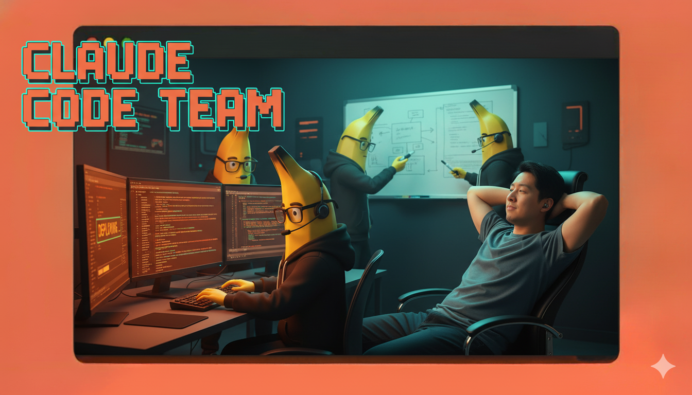

# Claude Agent SDK: Step-by-Step Tutorial

## Watch the Video!

[](https://youtu.be/gP5iZ6DCrUI)

Claude Code is probably the most impressive and most capable AI agent that you know. If only you could leverage it to help you with anything and everything... Well now you can! The Claude Agent SDK is a high-level framework for building custom AI Agent systems using Claude Code as the core agent.

## What You'll Learn

- Create AI agents that can read, write, and edit files autonomously
- Build conversational agents that remember context across multiple exchanges
- Integrate powerful external tools through Model Context Protocol (MCP)
- Design specialized subagents that handle complex, multi-step workflows
- Configure agent behavior with custom system prompts and tool permissions

## Prerequisites

Before starting, make sure you have:

- **Python 3.13+** installed on your system
- **uv** installed [instructions](https://docs.astral.sh/uv/getting-started/installation/)
- **Claude Code** installed
`npm install -g @anthropic-ai/claude-code`
- **Chrome browser** (required for Modules 5-6 for Playwright MCP integration)
- **Node.js** (required for Modules 5-6 for Playwright MCP integration)

Optional (see Step 3 below):
You can either use an Anthropic API key or authenticate with Claude Code. If authenticating with Claude Code, you don't need to set an API key.
- **Anthropic API key** (get one at [console.anthropic.com](https://console.anthropic.com))

## Quick Start

### 1. Clone the Repository

```bash
git clone https://github.com/kenneth-liao/claude-agent-sdk-intro
cd claude-agent-sdk-intro
```

### 2. Set Up Environment

Create a virtual environment and install dependencies:

```bash
uv sync
```

### 3. Configure API Key (Optional)

If you are using an Anthropic API key (see prerequisites above),

Create a `.env` file in the project root:

```bash
ANTHROPIC_API_KEY=your_api_key_here
```

### 4. Configure Local Settings

**Important:** The `.claude/settings.json` file contains system-specific file paths that need to be updated for your local environment.

Edit `.claude/settings.json` and update the sound file paths to match your system. You may also have to update the uv run command path to the absolute path to the python file.

```json
{
  "outputStyle": "Personal Assistant",
  "hooks": {
    "Stop": [
      {
        "hooks": [
          {
            "type": "command",
            "command": "afplay /System/Library/Sounds/Funk.aiff"
          },
          {
            "type": "command",
            "command": "uv run .claude/hooks/log_agent_actions.py"
          }
        ]
      }
    ],
    "Notification": [
      {
        "hooks": [
          {
            "type": "command",
            "command": "afplay /System/Library/Sounds/Purr.aiff"
          }
        ]
      }
    ]
  }
}
```

**For macOS users:** The default paths should work as-is.

**For Linux/Windows users:** Replace the `afplay` commands with appropriate alternatives:
- **Linux:** Use `aplay`, `paplay`, or `play` (from sox)
- **Windows:** Use `powershell -c (New-Object Media.SoundPlayer "C:\Windows\Media\notify.wav").PlaySync()`

Or simply remove the sound commands if you don't want audio notifications.

### 5. Run Your First Module

```bash
python 0_querying.py
```

## Module Overview

### Module 0: Querying Basics
**File:** `0_querying.py`

Learn the two fundamental ways to interact with Claude: `query()` for one-off tasks and `ClaudeSDKClient` for continuous conversations. Understand when to use each approach and how to configure basic agent options.

### Module 1: Message Handling
**File:** `1_messages.py`

Master parsing and displaying different message types from the SDK. Learn to create a clean CLI interface using Rich for better user experience with formatted output and status indicators.

### Module 2: Custom Tools
**File:** `2_tools.py`

Build your first custom tool by creating a product search function. Learn the three-step process: define the tool, create an MCP server, and configure the agent. Understand tool naming conventions and integration patterns.

### Module 3: Agent Options
**File:** `3_options.py`

Configure agent behavior with `ClaudeAgentOptions`. Control tool permissions, set custom system prompts, choose models, and manage file access. Experiment with different option combinations to see how they interact.

### Module 4: Conversation Loops
**File:** `4_convo_loop.py`

Build a continuous conversation interface where users can chat back and forth with the agent. Learn how to maintain context across multiple turns and create a natural conversational experience.

### Module 5: Model Context Protocol (MCP)
**File:** `5_mcp.py` | **Docs:** [module-5-mcp.md](docs/module-5-mcp.md)

Integrate external tools through MCP servers. Connect Playwright for browser automation, enabling your agent to navigate websites, take screenshots, and interact with web pages. Discover the MCP ecosystem and how to add powerful capabilities beyond built-in tools.

**Prerequisites:** Node.js and Chrome browser

### Module 6: Subagents
**File:** `6_subagents.py` | **Docs:** [module-6-subagents.md](docs/module-6-subagents.md)

Create specialized AI agents that handle specific tasks independently. Learn to delegate work to expert subagents with isolated contexts and restricted tool access. Build multi-agent systems that can research topics, analyze data, and coordinate complex workflows in parallel.

**Prerequisites:** Module 5 (uses MCP tools)

## Running the Modules

Each module can be run independently:

```bash
# Run with default Haiku model (fast, economical)
python <module_file>.py

# Run with Sonnet model (balanced performance)
python <module_file>.py --model claude-sonnet-4-20250514

# Run with Opus model (maximum capability)
python <module_file>.py --model claude-opus-4-20250514
```

Note: Modules 0-2 have their model hardcoded. Modules 3-6 accept `--model` flag.

## Project Structure

```
claude-agent-sdk-intro/
├── 0_querying.py           # Basic querying patterns
├── 1_messages.py           # Message parsing and display
├── 2_tools.py              # Custom tool creation
├── 3_options.py            # Agent configuration
├── 4_convo_loop.py         # Conversation loops
├── 5_mcp.py                # MCP integration
├── 6_subagents.py          # Multi-agent systems
├── cli_tools.py            # Helper functions for CLI
├── main.py                 # (Optional) Main entry point
├── db/                     # Sample data for tools
├── docs/                   # Detailed module documentation
└── .claude/                # Claude agent configurations
```

## Additional Resources

- [Agent SDK Documentation (Python)](https://docs.claude.com/en/api/agent-sdk/python)
- [MCP Servers Directory](https://github.com/modelcontextprotocol/servers)
- [Anthropic API Documentation](https://docs.anthropic.com)

## Tips for Learning

1. **Follow in order** - Each module builds on concepts from previous ones
2. **Experiment** - Modify the code, try different prompts, and see what happens
3. **Read the docs** - Modules 5 and 6 have detailed documentation with examples
4. **Start simple** - Use Haiku for testing, upgrade to Sonnet for production
5. **Check the source** - The helper functions in `cli_tools.py` show useful patterns

## Common Issues

**Import errors:** Make sure you've run `uv sync` and activated your virtual environment

**API errors:** Verify your `ANTHROPIC_API_KEY` is set correctly in `.env`

**Module 5-6 not working:** Ensure Node.js and Chrome are installed for Playwright

**Sound/notification errors:** Update the file paths in `.claude/settings.json` to match your system's sound files, or remove the sound commands if not needed

## Next Steps

After completing all modules:

- Build your own specialized agents for specific tasks
- Explore the MCP ecosystem for additional tools
- Combine concepts to create sophisticated multi-agent workflows
- Share your creations with the community

Happy building! 🚀
