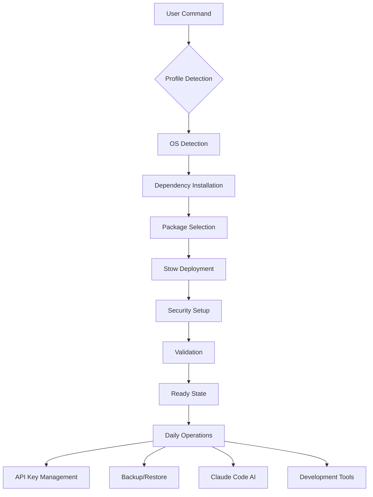

# Dotfiles Project - Comprehensive Documentation

> **Version**: 2.0.0  
> **Last Updated**: September 2025  
> **Maintainer**: smian0  

## Executive Summary

This is a sophisticated personal dotfiles repository designed for cross-platform environment consistency across macOS and Ubuntu Linux systems. The project implements a modular architecture using GNU Stow for symlink management, supports multiple installation profiles, integrates comprehensive AI development tools (Claude Code), and provides enterprise-grade security through GPG-encrypted password management.

## Table of Contents

| Section | Description | 
|---------|-------------|
| [🏗️ Architecture](#architecture) | System design and core components |
| [⚙️ Installation](#installation) | Setup procedures and profiles |
| [📦 Packages](#packages) | Available configuration packages |
| [🔐 Security](#security) | Security features and best practices |
| [🧪 Testing](#testing) | Testing infrastructure and commands |
| [📚 Documentation](#documentation) | Complete documentation index |
| [🛠️ Development](#development) | Development workflow and contribution |

## Architecture

### Core Design Principles

| Principle | Implementation | Benefits |
|-----------|----------------|----------|
| **Modularity** | GNU Stow packages | Selective installation, easy maintenance |
| **Cross-Platform** | OS detection scripts | Consistent experience across systems |
| **Security-First** | GPG + pass integration | Encrypted secret management |
| **Profile-Based** | Multiple installation profiles | Environment-specific configurations |
| **AI-Enhanced** | Claude Code integration | AI-assisted development workflows |
| **Testable** | Comprehensive test suite | Reliable deployments and updates |

### System Components

```
~/.dotfiles/
├── 📦 Core Packages
│   ├── git/              # Git configuration and hooks
│   ├── zsh/              # Zsh shell with AI tools
│   ├── vim/              # Vim editor configuration
│   └── ssh/              # SSH client configuration
├── 🤖 AI Integration
│   ├── claude/           # Global Claude Code settings
│   ├── claude-project/   # Project-specific Claude configs
│   └── cursor/           # Cursor AI IDE settings
├── 🔧 Automation
│   ├── scripts/          # Management and utility scripts
│   ├── chrome-automation/ # Browser automation tools
│   └── .taskmaster/      # Task Master AI integration
├── 🔐 Security
│   ├── pass/             # Password store configuration
│   ├── pass-store/       # Encrypted password database
│   └── git/hooks/        # Security pre-commit hooks
└── 📋 Management
    ├── profiles/         # Installation profile definitions
    ├── tests/            # Comprehensive test suite
    └── docs/             # Complete documentation
```

### Data Flow Architecture



## Installation

### Quick Start Matrix

| Use Case | Profile | Command | Result |
|----------|---------|---------|--------|
| **New Machine** | Auto-detect | `make bootstrap` | Complete setup with OS dependencies |
| **Development** | development | `make install` | Full development environment |
| **Server/CI** | minimal | `make install-minimal` | Essential tools only |
| **Corporate** | work | `make install-work` | Work-appropriate configuration |
| **Personal** | personal | `make install-personal` | Full personal setup |

### Installation Profiles

#### 📋 Profile Comparison

| Package | Minimal | Development | Full | Work | Personal |
|---------|---------|-------------|------|------|----------|
| **git** | ✅ | ✅ | ✅ | ✅ | ✅ |
| **zsh** | ✅ | ✅ | ✅ | ✅ | ✅ |
| **claude-default** | ✅ | ✅ | ✅ | ✅ | ✅ |
| **claude-experimental** | ❌ | ✅ | ✅ | ❌ | ✅ |
| **vim** | ❌ | ❌ | ✅ | ❌ | ✅ |
| **npm-configs** | ❌ | ✅ | ✅ | ✅ | ✅ |
| **pass** | ❌ | ❌ | ✅ | ❌ | ✅ |
| **chrome-automation** | ❌ | ❌ | ✅ | ❌ | ❌ |

#### 🎯 Profile Use Cases

| Profile | Target Environment | Key Features | Installation Time |
|---------|-------------------|--------------|------------------|
| **minimal** | Servers, CI/CD | Essential tools, lightweight | ~2 minutes |
| **development** | Development machines | AI tools, utilities | ~5 minutes |
| **full** | Power users | All packages | ~8 minutes |
| **work** | Corporate environments | Professional tools only | ~4 minutes |
| **personal** | Personal computers | Full customization | ~6 minutes |

## Packages

### 🔧 Core Configuration Packages

#### Git Package (`git/`)
**Purpose**: Git configuration with security hooks  
**Features**:
- GPG commit signing
- Pre-commit secret detection hooks  
- Custom aliases and workflow improvements
- Cross-platform configuration

**Key Files**:
- `.gitconfig` - Global Git configuration
- `hooks/pre-commit` - Security scanning hook
- `gitignore_global` - Global ignore patterns

#### Zsh Package (`zsh/`)
**Purpose**: Enhanced shell environment with AI integration  
**Features**:
- AI tools integration (Claude, GPT)
- SSH agent auto-configuration
- Custom aliases and functions
- Agent-based workflow support

**Key Files**:
- `.zshrc` - Main shell configuration
- `llm-tools.zsh` - AI tool integrations
- `agents-md.zsh` - Agent framework support
- `ssh-agent.zsh` - SSH key management

### 🤖 AI Enhancement Packages

#### Claude Package (`claude/`)
**Purpose**: Global Claude Code AI assistant configuration  
**Features**:
- AI-powered development assistance
- Custom commands and workflows
- Model configuration and preferences
- Tool permission management

**Key Files**:
- `settings.json` - Global Claude preferences
- `commands/` - Custom AI commands
- `output-styles/` - Response formatting styles

#### Claude Project Package (`claude-project/`)
**Purpose**: Project-specific AI configurations  
**Features**:
- Per-project AI settings
- Project-specific guidance (CLAUDE.md)
- Custom agents and workflows
- Team-shareable configurations

### 🔐 Security Packages

#### Pass Package (`pass/`)
**Purpose**: Password manager configuration  
**Features**:
- GPG-encrypted password storage
- API key management
- Cross-device synchronization
- Git-backed password store

#### SSH Package (`ssh/`)
**Purpose**: SSH client configuration  
**Features**:
- Host-specific configurations
- Key management
- Security hardening
- Agent integration

### 🛠️ Development Packages

#### Vim Package (`vim/`)
**Purpose**: Vim editor configuration  
**Features**:
- Syntax highlighting
- Plugin management
- Custom key bindings
- Development-focused setup

## Security

### 🔒 Security Architecture

| Layer | Component | Protection Level | Purpose |
|-------|-----------|------------------|---------|
| **Storage** | GPG + Pass | Military-grade encryption | Secret storage |
| **Transport** | SSH + TLS | Industry standard | Secure communication |
| **Code** | Pre-commit hooks | Real-time scanning | Secret leak prevention |
| **Access** | File permissions | OS-level protection | Local security |

### 🛡️ Security Features

#### Automated Secret Detection
```bash
# Real-time scanning
make check-secrets      # Repository-wide scan
make install-hooks      # Install git security hooks
```

**Detected Patterns**:
- API keys (OpenAI, GitHub, AWS, Anthropic)
- Private keys (RSA, SSH, PGP)
- Database credentials
- OAuth tokens
- Cloud service keys

#### Encrypted Password Management
```bash
# API key management
make api-status         # Show key status
make api-sync          # Sync with environment
pass insert api/openai  # Store API key securely
```

#### Security Audit Commands
```bash
make doctor            # Comprehensive security check
make audit             # Configuration audit
./scripts/validate-config.sh --audit  # Deep security scan
```

## Testing

### 🧪 Testing Infrastructure

| Test Type | Framework | Coverage | Runtime |
|-----------|-----------|----------|---------|
| **Unit Tests** | ShellSpec | Individual functions | ~30 seconds |
| **Integration** | ShellSpec | Component interaction | ~2 minutes |
| **E2E Tests** | Docker | Full installation flows | ~5 minutes |
| **Security** | Custom scanners | Secret detection | ~15 seconds |

### 🏃‍♂️ Test Commands

```bash
# Quick Development Cycle
make test-quick         # Fast validation (30s)
make lint              # Code quality check (15s)

# Comprehensive Testing
make test              # Full E2E suite (5min)
make test-all          # All scenarios (10min)

# Specific Test Types
make test-integration  # Component tests
make test-security     # Security scans
```

### 🐳 Docker Testing Environment

```bash
# Test specific scenarios
make test TEST=basic    # Basic installation
make test TEST=full     # Full installation
make test TEST=claude   # Claude Code setup
make test TEST=switch   # Profile switching

# Results analysis
./view-test-results.sh  # Interactive test report
```

## Documentation

### 📚 Complete Documentation Index

| Document | Purpose | Audience |
|----------|---------|----------|
| **[README.md](../README.md)** | Quick start guide | New users |
| **[SETUP.md](SETUP.md)** | Detailed installation | All users |
| **[SECURITY.md](SECURITY.md)** | Security best practices | Security-conscious users |
| **[CLAUDE.md](CLAUDE.md)** | AI configuration guide | AI developers |
| **[DEVELOPMENT.md](DEVELOPMENT.md)** | Development workflow | Contributors |
| **[TROUBLESHOOTING.md](TROUBLESHOOTING.md)** | Problem resolution | Support |
| **[GPG-SETUP.md](GPG-SETUP.md)** | GPG key management | Security setup |
| **[PROFILES.md](../PROFILES.md)** | Profile system | Environment setup |

### 📖 Documentation Categories

#### User Guides
- **Setup & Installation**: Complete installation procedures
- **Daily Operations**: Common usage patterns and workflows  
- **Security Practices**: Best practices for secure usage
- **Troubleshooting**: Problem resolution guides

#### Technical References
- **API Documentation**: Script and command references
- **Architecture Guide**: System design and components
- **Testing Guide**: Testing procedures and frameworks
- **Development Guide**: Contribution and development workflows

## Development

### 🔄 Development Workflow

| Phase | Actions | Commands |
|-------|---------|----------|
| **Setup** | Clone, bootstrap | `git clone && make bootstrap` |
| **Development** | Edit, test, validate | `make test-quick && make lint` |
| **Integration** | Full test suite | `make test-all` |
| **Release** | Documentation, backup | `make docs && make backup` |

### 🛠️ Key Development Commands

```bash
# Development Environment
make dev-setup         # Setup development tools
make demo             # Dry-run installation

# Code Quality
make lint             # Shellcheck validation
make format           # Code formatting
make check-secrets    # Security scanning

# Maintenance
make update           # Update repository and tools
make clean           # Remove temporary files
make doctor          # Health check
```

### 📝 Contribution Guidelines

1. **Branch Strategy**: Feature branches from `main`
2. **Code Quality**: All scripts must pass `make lint`
3. **Testing**: New features require tests
4. **Documentation**: Update relevant docs
5. **Security**: Run `make check-secrets` before commits

### 🔧 Debugging and Maintenance

```bash
# System Information
make info             # Detailed system info
make debug           # Debug information
make status          # Current installation status

# Maintenance Operations  
make backup          # Create system backup
make restore         # Restore from backup
make clean-backups   # Cleanup old backups
```

## Project Statistics

| Metric | Value | Notes |
|--------|-------|-------|
| **Configuration Files** | 200+ | Across all packages |
| **Scripts** | 25+ | Automation and utilities |
| **Test Cases** | 100+ | Unit and integration tests |
| **Documentation Pages** | 15+ | Comprehensive guides |
| **Supported OS** | 2 | macOS and Ubuntu Linux |
| **Installation Profiles** | 5 | Covering all use cases |
| **Security Checks** | 10+ | Multi-layer protection |

## Version History

| Version | Date | Key Features |
|---------|------|--------------|
| **2.0.0** | 2024-09 | Task Master AI integration, enhanced testing |
| **1.5.0** | 2024-08 | Claude Code profiles, Docker E2E testing |
| **1.0.0** | 2024-07 | Initial release with GNU Stow architecture |

---

## Related Resources

- **[Main Repository](https://github.com/smian0/dotfiles)** - Source code and issues
- **[Installation Guide](SETUP.md)** - Step-by-step setup instructions  
- **[Security Guide](SECURITY.md)** - Security best practices and GPG setup
- **[AI Tools Guide](AI-TOOLS-GUIDE.md)** - Claude Code and AI integration
- **[Troubleshooting](TROUBLESHOOTING.md)** - Common issues and solutions

> 💡 **Tip**: Start with `make bootstrap` for new installations or `make status` to check your current setup.

*This documentation is automatically updated with each release. Last generated: September 2025*